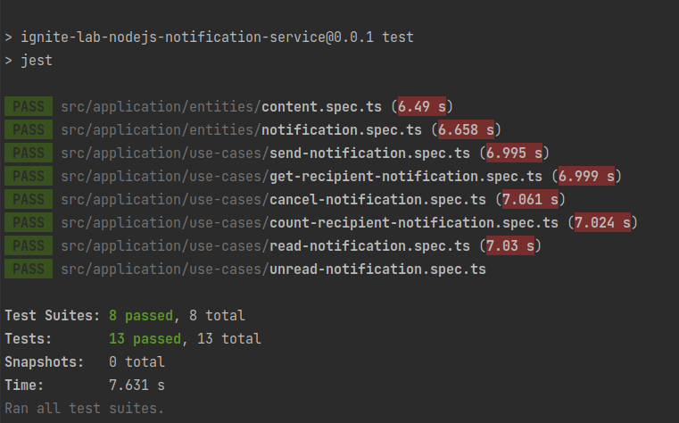

<p align="center">
  <a href="#-tecnologias">Tecnologias</a>&nbsp;&nbsp;&nbsp;|&nbsp;&nbsp;&nbsp;
  <a href="#-projeto">Projeto</a>&nbsp;&nbsp;&nbsp;|&nbsp;&nbsp;&nbsp;
  <a href="#-como-rodar">Como rodar</a>&nbsp;&nbsp;&nbsp;|&nbsp;&nbsp;&nbsp;
  <a href="#-rotas">Rotas</a>&nbsp;&nbsp;&nbsp;|&nbsp;&nbsp;&nbsp;
  <a href="#-como-contribuir">Como contribuir</a>&nbsp;&nbsp;&nbsp;
  </p>

<br>


## Ignite Lab NodeJS - Notification Service

## 🚀 Tecnologias

Esse projeto foi desenvolvido com as seguintes tecnologias:

- [NodeJS](https://nodejs.org/en/) - 18.12.1
- [Yarn](https://yarnpkg.com/) - 0.32+git
- [Npm](https://www.npmjs.com/) - 8.19.2

## 💻 Projeto

API para envio, cancelamento de notificações.


Resolulção do teste.
<p align="center">
  
</p>


## 🚀 Como Rodar

- Clone o projeto.
- Entre na pasta do projeto e rode npm install (pode usar yarn install de acordo com a sua configuração).
- npx prisma migrate dev
- npx prisma studio (abre uma pagina para ver o banco de dados)
- npm run start:dev para rodar o projeto (localhost:3000).

## 👩🏿‍💻 Rotas

- **`POST /notifications`**: Roda de criação de notificações

Enviar:
```
{
    "content":  "test",
    "category": "test",
    "recipientId": "c1d4fe30-229a-4bb0-8f44-d4d0e5df9246"
}
```
Retorna:
```
{
    "notification": {
        "id": "f40b9fcb-d6b0-4988-913e-ff8ffaa70e0b",
        "category": "test",
        "content": "test",
        "recipientId": "c1d4fe30-229a-4bb0-8f44-d4d0e5df9246"
    }
}
```

- **`PATCH /notifications/:id/cancel`**: Roda de cancelar notificações

- **`PATCH /notifications/:id/read`**: Roda de marcar uma notificação como lida

- **`PATCH /notifications/:id/unread`**: Roda de marcar uma notificação como não lida

- **`GET /notifications/count/from/:recipientId`**: Roda de contar quantas notificações de um mesmo usaurio teve.

  Retorna:
```
{
    "count": 1
}
```

- **`GET /notifications/from/:recipientId`**: Roda de mostras as notificações de um mesmo usaurio teve.

  Retorna:
```
{
    "notifications": [
        {
            "id": "f40b9fcb-d6b0-4988-913e-ff8ffaa70e0b",
            "category": "test",
            "content": "test",
            "recipientId": "c1d4fe30-229a-4bb0-8f44-d4d0e5df9246"
        }
    ]
}
```

## 🤔 Como contribuir

- Faça um fork desse repositório;
- Cria uma branch com a sua feature: `git checkout -b minha-feature`;
- Faça commit das suas alterações: `git commit -m 'feat: Minha nova feature'`;
- Faça push para a sua branch: `git push origin minha-feature`.

Depois que o merge da sua pull request for feito, você pode deletar a sua branch.

## 📝 Licença

Esse projeto está sob a licença MIT.
